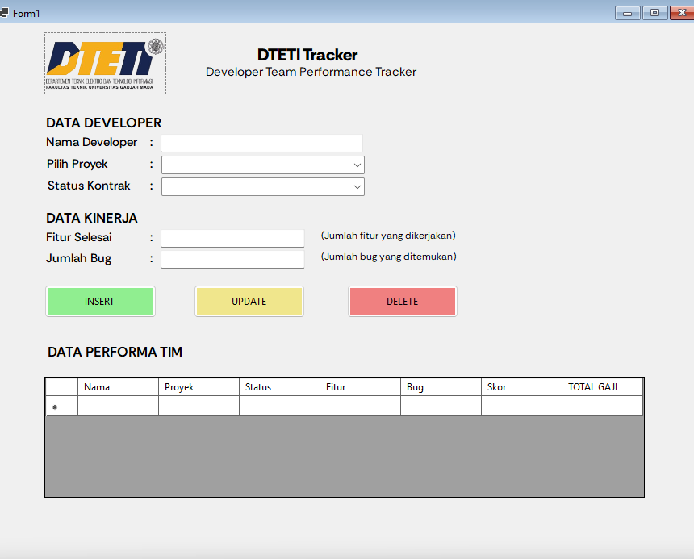
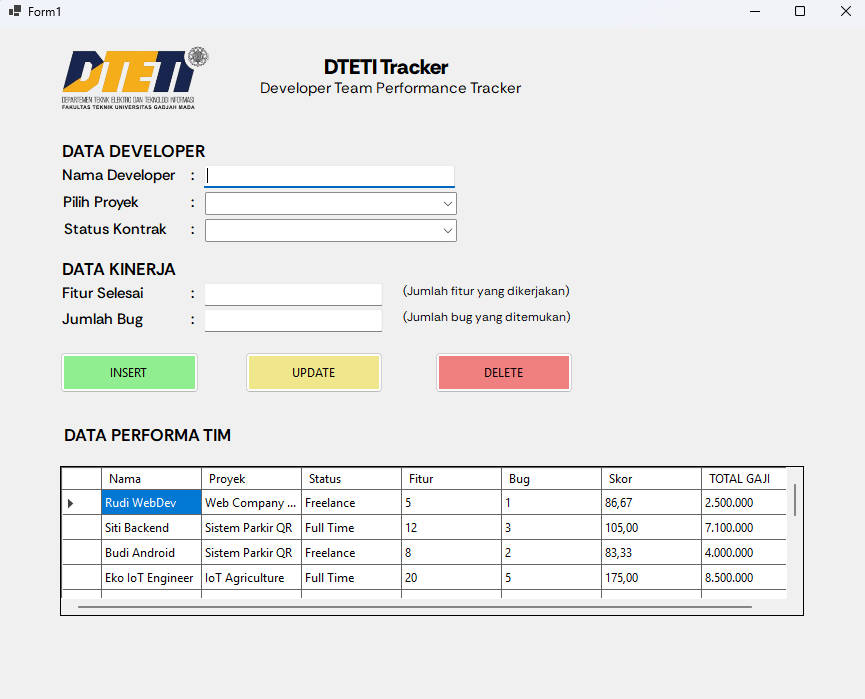
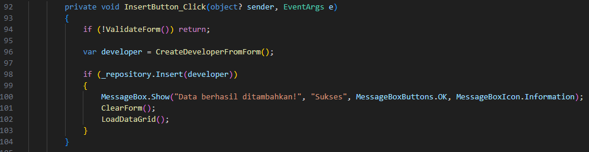
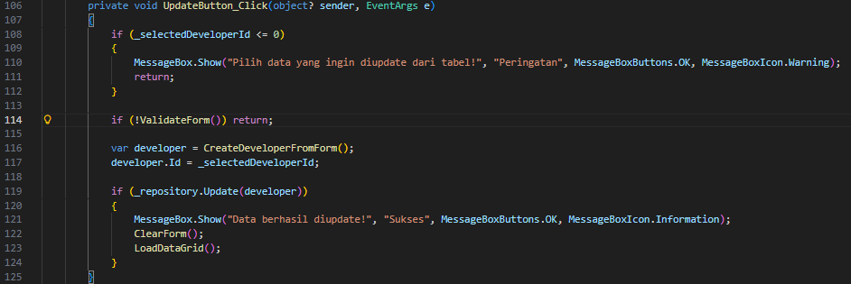
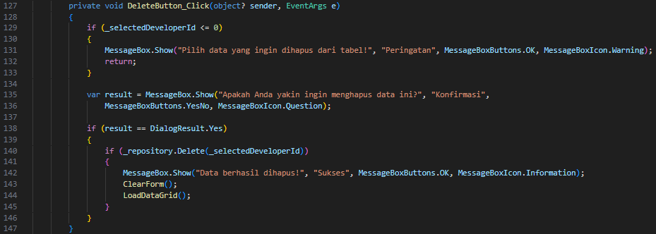
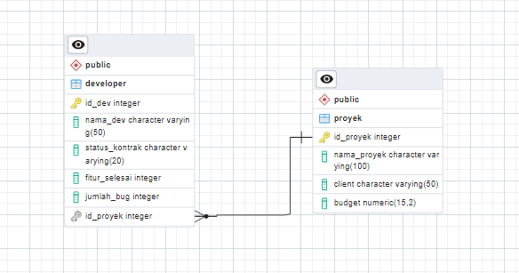

# 📚 Responsi 2 Junior Project - Aplikasi Manajemen Developer

| No. | Nama | NIM |
|-----|----- |-----|
|1.   | Muhammad Rhizal Rhomadon  | 514719 |

---

## Tampilan dan Fungsi Aplikasi

### 1. Interface Aplikasi di Visual Studio (Design View)


### 2. Hasil Build Aplikasi


### 3. Tombol Insert - Menambah Data Developer Baru


### 4. Tombol Edit - Mengubah Data Developer


### 5. Tombol Delete - Menghapus Data Developer


---

## ERD PostgresSQL


---

## 🗄️ Struktur Database PostgreSQL

**Tabel Proyek (Parent)**
```sql
CREATE TABLE proyek (
    id_proyek SERIAL PRIMARY KEY,
    nama_proyek VARCHAR(100),
    client VARCHAR(50),
    budget NUMERIC(15, 2)
);
```

**Tabel Developer (Child)**
```sql
CREATE TABLE developer (
    id_dev SERIAL PRIMARY KEY,
    nama_dev VARCHAR(50),
    status_kontrak VARCHAR(20),  
    fitur_selesai INT DEFAULT 0,
    jumlah_bug INT DEFAULT 0,
    id_proyek INTEGER REFERENCES proyek(id_proyek) ON DELETE CASCADE
);
```

**Insert Data Awal**
```sql
INSERT INTO proyek (nama_proyek, client, budget) VALUES 
('Web Company Profile', 'CV Sejahtera', 8000000),             
('Sistem Parkir QR', 'Dinas Perhubungan', 15000000),         
('IoT Agriculture', 'Tani Maju Indonesia', 25000000),         
('E-Commerce Startup', 'PT Maju Mundur', 100000000),          
('AI Fraud Detection', 'Unicorn Fintech', 150000000);         
```

---

## 🎯 Menerapkan OOP (Object-Oriented Programming)

#### a. 🔒 ENCAPSULATION
Menyembunyikan data dengan `private` field, akses melalui `public` property.
```csharp
public class Developer : BaseModel
{
    // Private fields
    private string _namaDeveloper = string.Empty;
    private int _fiturSelesai;
    private double _skorTotal;
    
    // Public properties dengan validasi
    public string NamaDeveloper
    {
        get { return _namaDeveloper; }
        set { _namaDeveloper = value ?? string.Empty; }
    }

    public int FiturSelesai
    {
        get { return _fiturSelesai; }
        set { _fiturSelesai = value >= 0 ? value : 0; }  // Validasi nilai negatif
    }

    public double SkorTotal
    {
        get { return _skorTotal; }
        private set { _skorTotal = value; }  // Read-only dari luar class
    }
}
```

#### b. 👪 INHERITANCE
Child class mewarisi properties dan methods dari parent class.
```csharp

// Child - Developer mewarisi BaseModel
public class Developer : BaseModel
{
    ...
}

// Child - Proyek mewarisi BaseModel
public class Proyek : BaseModel
{
    ...
}
```

#### c. 🎭 POLYMORPHISM
Method sama (`IsValid()`), implementasi berbeda di tiap class.
```csharp
// Developer - validasi 3 field
public override bool IsValid()
{
    return !string.IsNullOrWhiteSpace(NamaDeveloper) &&
           !string.IsNullOrWhiteSpace(NamaProyek) &&
           !string.IsNullOrWhiteSpace(StatusKontrak);
}
```

#### d. 🎨 ABSTRACTION
Menyembunyikan detail implementasi, menggunakan SQL Functions (bukan raw query).


```csharp
// Abstract class Skor - user tidak perlu tahu rumus berbeda tiap status
public abstract class Skor
{
    public abstract double HitungSkor();  // Implementasi di child class
}
```

---

## SQL Functions (Tidak Raw Query)

Semua operasi database menggunakan SQL Functions yang sudah dibuat di PostgreSQL.

| Function | Deskripsi |
|----------|-----------|
| `get_all_developers()` | Mengambil semua developer dengan JOIN proyek |
| `get_developer_by_id(id)` | Mengambil developer berdasarkan ID |
| `get_all_proyek()` | Mengambil semua proyek dengan budget |
| `get_budget_proyek(nama)` | Mengambil budget proyek |
| `get_total_pengeluaran_proyek(nama)` | Mengambil data developer untuk hitung gaji |
| `insert_developer(...)` | Insert developer baru |
| `update_developer(...)` | Update data developer |
| `delete_developer(id)` | Hapus developer |

---

## Cara Menjalankan

### 1. Setup Database PostgreSQL
```sql
CREATE DATABASE responsi;
```

### 2. Buat Tabel
```sql
-- Tabel Proyek (Parent)
CREATE TABLE proyek (
    id_proyek SERIAL PRIMARY KEY,
    nama_proyek VARCHAR(100),
    client VARCHAR(50),
    budget NUMERIC(15, 2)
);

-- Tabel Developer (Child)
CREATE TABLE developer (
    id_dev SERIAL PRIMARY KEY,
    nama_dev VARCHAR(50),
    status_kontrak VARCHAR(20),
    fitur_selesai INT DEFAULT 0,
    jumlah_bug INT DEFAULT 0,
    id_proyek INTEGER REFERENCES proyek(id_proyek) ON DELETE CASCADE
);
```

### 3. Insert Data Awal
```sql
INSERT INTO proyek (nama_proyek, client, budget) VALUES 
('Web Company Profile', 'CV Sejahtera', 8000000),             
('Sistem Parkir QR', 'Dinas Perhubungan', 15000000),         
('IoT Agriculture', 'Tani Maju Indonesia', 25000000),         
('E-Commerce Startup', 'PT Maju Mundur', 100000000),          
('AI Fraud Detection', 'Unicorn Fintech', 150000000);   
```

### 4. Update Connection String
Edit `Repositories/DatabaseConnection.cs`:
```csharp
"Host=localhost;Port=5432;Database=responsi;Username=postgres;Password=YOUR_PASSWORD"
```

### 5. Build & Run
```bash
cd Responsi2-Junpro
dotnet build
dotnet run
```